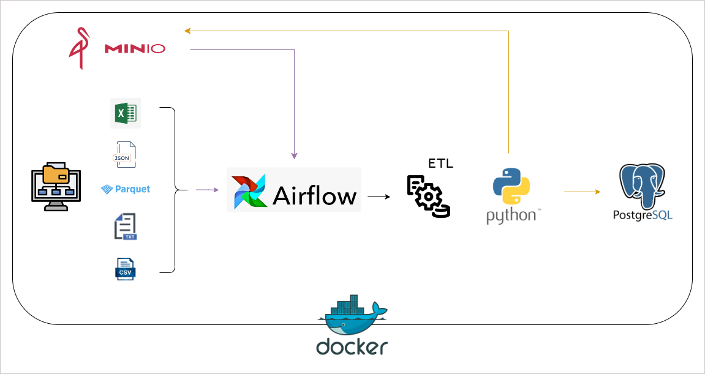
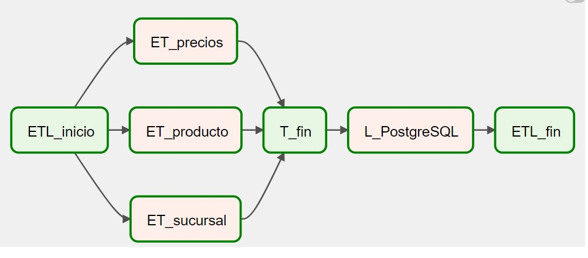
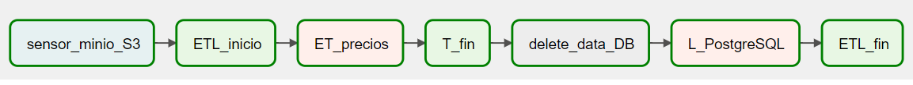
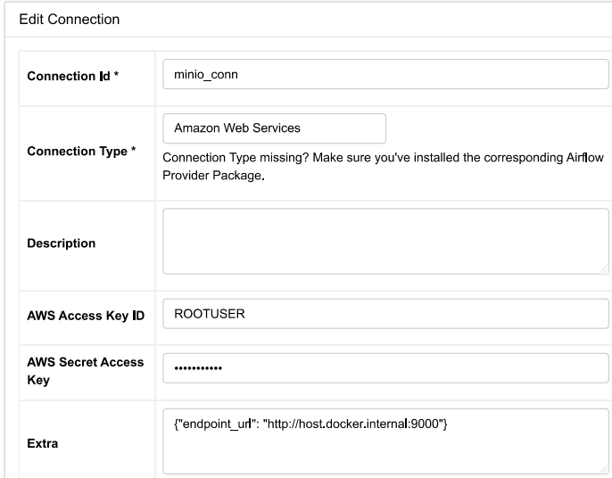
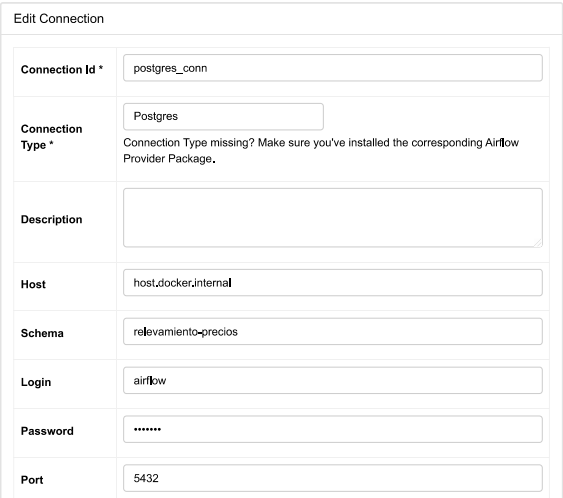

# Proyecto: Data Engineering
#### Autor: Luciano Barcenilla Simón
#### contacto:
#####           - mail: barcenillasimonluciano@gmail.com

## Objetivo:

Desarrollar un proceso de ETL con carga incremental a partir de datos sobre relevamientos de precios.

## Datos:

Cuento con archivos referentes a sucursales, productos y precios semanales, estos están alojados
de manera local y presentan distintos formatos.

## Glosario del trabajo:

#### Diccionario de datos

Archivos con los relevamientos semanales (ej: precio_semana_20200518.txt)
~~~
precio: Precio del producto en pesos argentinos.
producto_id: Código EAN del producto.
sucursal_id: ID de la sucursal. Los dos primeros números determinan la cadena.
~~~

~~~
Productos.parquet 

id: Código EAN del producto.
marca: Marca del producto.
nombre: Detalle del producto.
Presentación: Unidad de presentación del producto.
categoria1: categoria a la que pertenece el producto.
categoria2: categoria a la que pertenece el producto.
categoria3: categoria a la que pertenece el producto.
~~~

~~~
Sucursales.csv  

Id: Es el ID principal, compuesto por la concatenación de banderaId-comercioId-sucursalId.
comercioId: es el identificador de la empresa controlante. Por ejemplo Hipermecado Carrefour y Express tienen mismo comercioId pero distinta banderaId
banderaId: Diferencia las distintas "cadenas" de la misma empresa. Vea, Disco y jumbo pertenecen al mismo comercio pero tienen distinta bandera.
banderaDescripcion: Nombre de fantasía de la Cadena
comercioRazonSocial: Nombre con la que está registrada legalmente la empresa.
provincia: Provincia donde está ubicado el comercio.
localidadl: Localidad donde está ubicado el comercio.
direccion: Dirección del comercio,
lat: Coordenadas de latitud de la ubicación del comercio
lng: Coordenadas de longitud de la ubicación del comercio
sucursalNombre: nombre de la localidad de la sucursal
sucursalTipo: clasificación del mercado
~~~

## Tareas:

#### 1- EDA y Preprocesamiento :

            Realicé un análisis exploratorio y preprocesamiento de datos para determinar los problemas
            presentes en cada archivo e ir desarrollando la base para las funciones de transformación.

#### 2- ETL:

            Trabajé el proceso de ETL de dos maneras:

####   - Desarrollo 1)

    Proceso simple de Extracción, transformación y carga por medio de funciones automatizadas de Python.

    Tecnologías: Python, Docker, PostgreSQL

####   - Desarrollo 2)

    En éste caso utilicé DAGs de Airflow para automatizar y gestionar el proceso programando el flujo de las tareas. 
    El contenido que tenía que compartir entre tareas superaba el tamaño máximo permitido, esto lo solucioné utilizando un bucket de MinIO como intermediario entre las tareas de transformación y carga, en él almacené los archivos ya transformados y luego los extraje en la tarea de carga a la base de datos de PostgreSQL.

    Para la carga inicial los archivos utilizados estaban almacenados de forma local.
    En el caso de la carga incremental a modo de ejemplo supuse que el cliente cargaría una vez por semana
    un archivo en un bucket MinIO, por lo que apliqué un sensor para detectar si en el depósito hay elementos o no.

    Tecnologías: Python, Docker, Airflow, MinIO, PostgreSQL

## Pasos:

#### Crear entorno virtual:

Situarse en la carpeta del proyecto y ejecutar por terminal:

virtualenv -p python3 venv

#### Activar entorno virtual

Ejecutar las siguientes sentencias por terminal

cd .\venv\Scripts\

cmd

activate

(para desactivar son los mismos pasos, sólo hay que cambiar activate por deactivate)

#### Extender la imagen de Airflow

Ubicarse en el directorio donde se encuentra el archivo .yml y ejecutar los siguientes comandos
para instalar las dependencias de python especificadas en el archivo requirements.txt. La construcción
de la imagen extendida se realiza según lo definido en el archivo Dockerfile.

docker build . --tag extending_airflow:latest

#### Iniciar contenedor (Airflow, PostgreSQL, PGAdmin)

docker compose up airflow-init

docker compose up -d

#### Iniciar contenedor MinIO

docker run -p 9000:9000 -p 9001:9001 -e "MINIO_ROOT_USER=ROOTUSER" -e "MINIO_ROOT_PASSWORD=CHANGEME123" --name MinIO minio/minio:latest server /data --console-address ":9001"

        
## Diagrama de flujo

## DAGs

#### Carga inicial

#### Carga incremental

## Conexiones

#### Airflow-MinIO

#### Airflow-PostgreSQL

